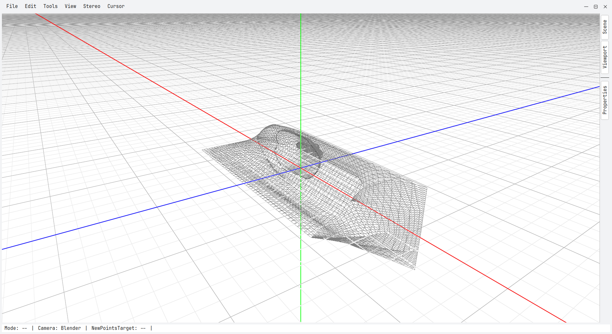
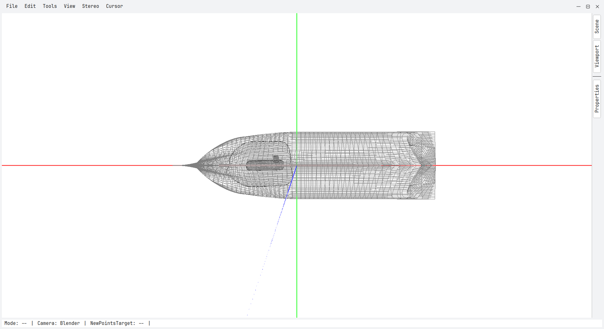
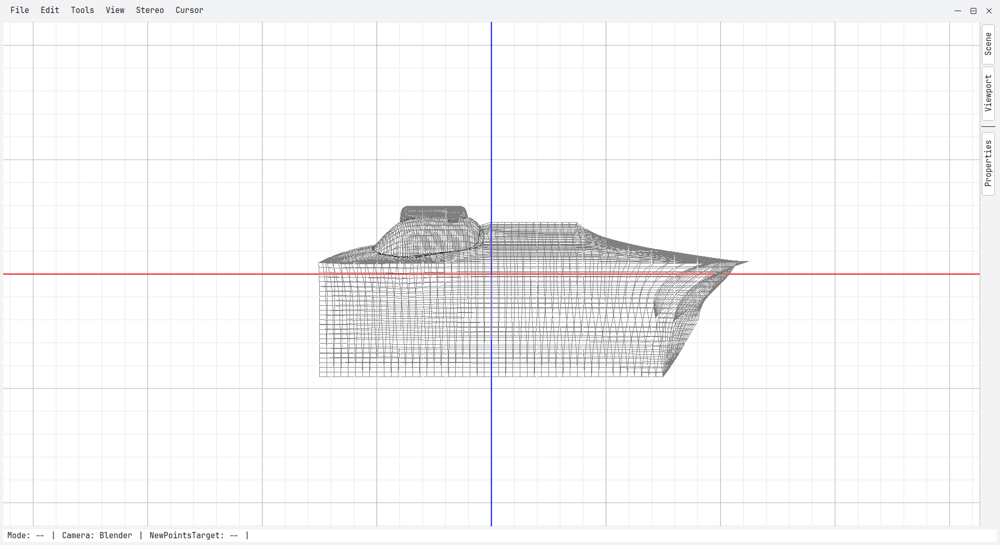
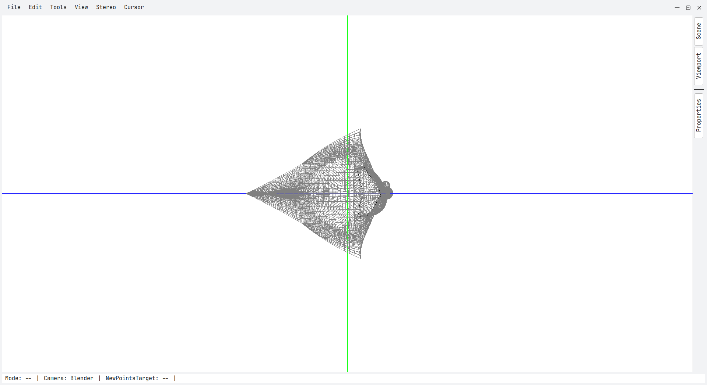
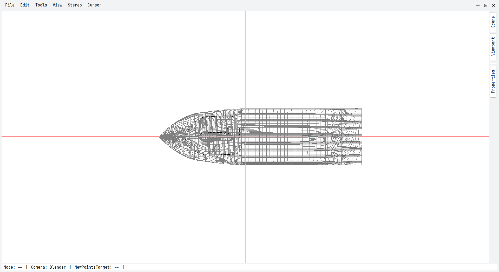
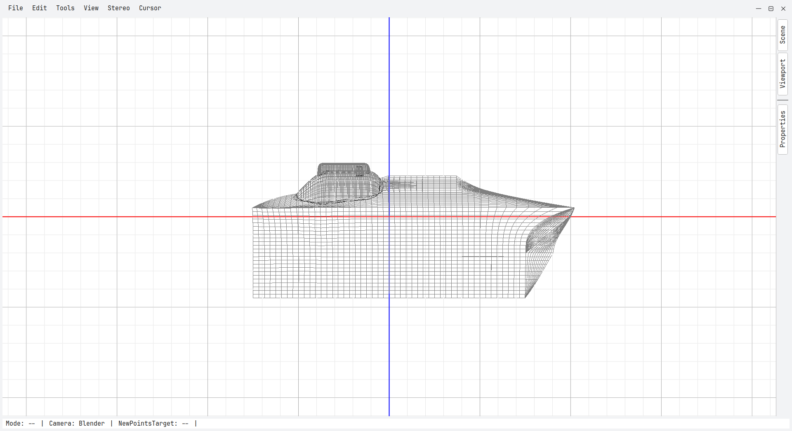
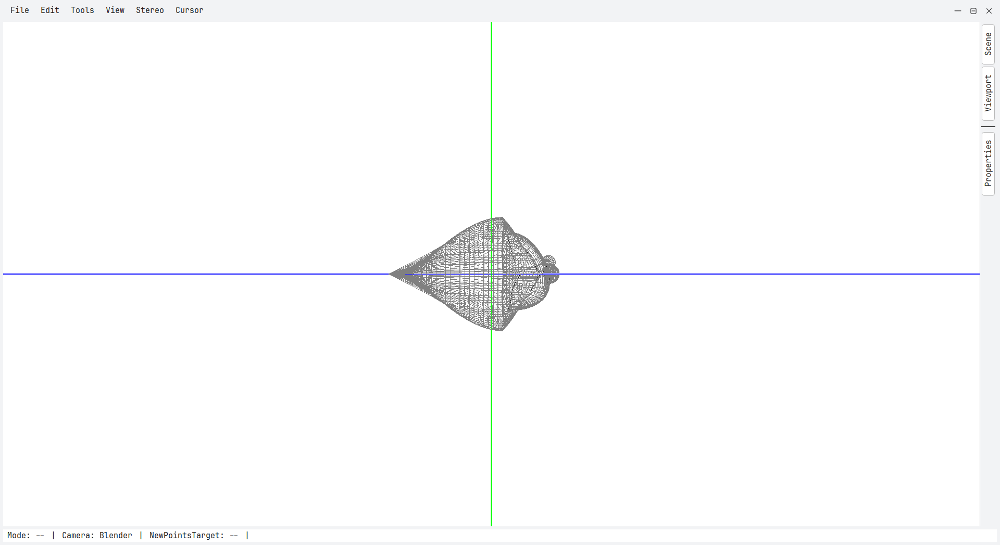
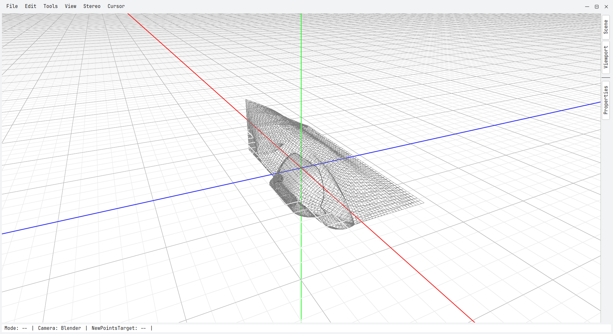
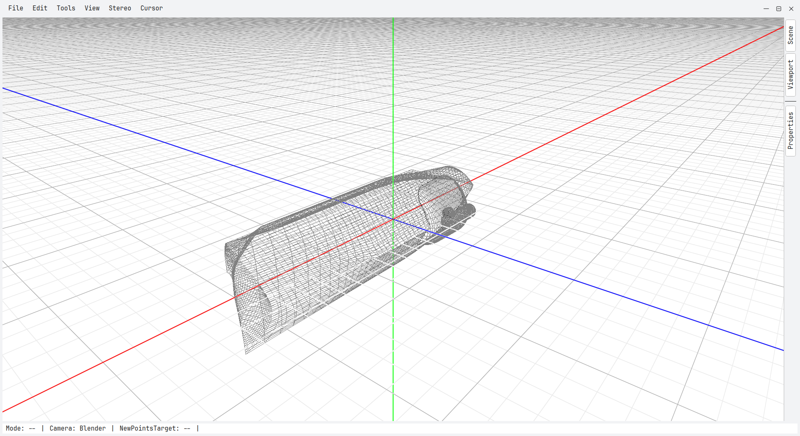
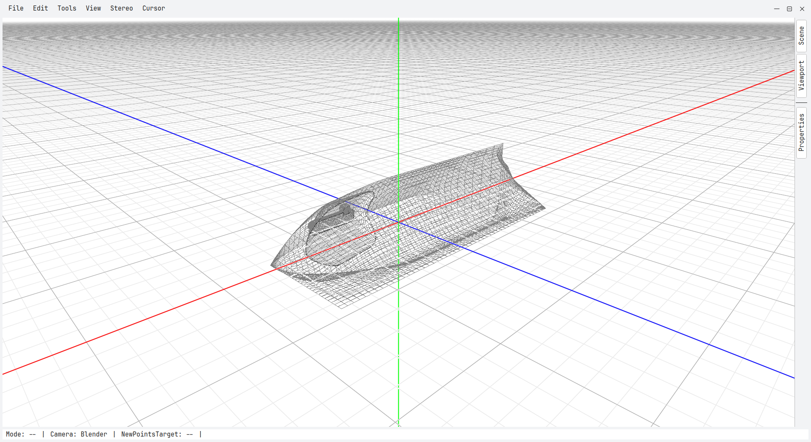

# Simple CAD/CAM from scratch

A simple CAD/CAM made iteratively during the Geometric Modeling 1 labs at WUT.
One of the project requirements was to not use any external math library
dependencies, i.e., to design and use an own math library (`cadm` in this
project; see [`./src/cad_math`](./src/cad_math). This includes custom vector and
matrix types, quaternions and more.

## Objects
The central concept of the system is an *Entity*. An Entity is a bag of
type-unique components. The idea was to allow reuse of components and more
flexibility. That flexibility is not exploited yet, though &mdash; component
factories currently create entities with mostly a single component. This can be
reworked in the future to allow sharing points between patches and curves of
different types, i.e., one bag-of-points component and multiple curve-type
components in a single entity.

The following entity types can be created:
- **Torus**
- **Bezier C0 curve** &mdash; C0-joint cubic Bezier curves
- **Bezier C2 curve** &mdash; C2-joint cubic Bezier curves
- **Interpolating C2 curve** &mdash; C2 interpolating Bezier curve
- **Bezier C0 patch** &mdash; a surface made of C0-joint cubic (4x4) Bezier
  patches
- **Bezier C2 patch** &mdash; a surface made of C2-joint cubic (4x4) Bezier
  patches
- **Gregory patch** &mdash; finds holes with cubic edges of Bezier C0 patches
  and fills them with Gregory nets. The UI only allows filling holes with 3
  edges, although the underlying implementation supports holes of any size of at
  least 3.
- **Intersections** &mdash; intersects two (or one) surfaces and creates an
  intersection component that holds the points along the intersection and
  whether it is closed. The number of points and the precision of the
  intersection can be adjusted by the user upon creation. With no user-supplied
  initial seed point, the nonlinear conjugate gradient method is first run from
  a grid of starting points and possibly finds many intersections; the point(s)
  found become the initial guesses of a Newton&ndash;Raphson tracing algorithm.
  If no user-supplied seed points were used (i.e., many intersections were
  possibly found), a further deduplication step is applied. The boundaries of
  the intersection can be visualized in the (u,v) parameter space of both
  surfaces, and the intersected surfaces can be trimmed along the curve (a
  per-patch grid mask applied by the fragment shader at render time). The
  intersection curve can also be transformed into an interpolation curve. For
  further details, refer to the source code.

## Operations
The command design pattern is used for the most important user actions. This
makes actions easy to undo and redo, which matters a lot in software design (be
forgiving).

## Scenes
Scenes can be saved and loaded in a custom JSON format (see the JSON schema at
[`./src/cad/format/schema.json`](./src/cad/format/schema.json). Scenes are
validated before loading, preventing corruption. On failure, the feedback is a
list of valijson validation issues.

## Stereography
The scene can be rendered in stereo, with automatically adjusted or user-set
convergence and eye separation distances.

## Model
Part of the course is creating a model &mdash; with a single theme across the
year &mdash; which will later be milled by a milling machine with 3 degrees of
freedom (the model therefore needs to be relief-like). The 2025/26 theme was
boats. The model I created will be available as a scene JSON at a later time
(after the course is finished). The models screenshot are available below (no
points rendered (no such feature available yet; modify the code by hand for the
result); trimming applied)



<details>
<summary>More views</summary>

  
  
  

</details>

## Libraries and building
The project uses CMake. You can use any CMake-compatible build system or IDE.
The libraries used are:
- **Qt6** &mdash; windowing and widgets
- **OpenGL** &mdash; graphics API
- **TBB** &mdash; `std::execution` dependency (you might need to change this to
  compile on your system)
- **valijson** &mdash; JSON schema validation
- **Catch2** &mdash; tests

valijson and Catch2 are supplied via CMake's FetchContent. Qt and TBB need to be
installed on your system, with paths set in CMake options if needed, e.g.
```
-DCMAKE_PREFIX_PATH=C:\Qt\6.10.2\msvc2022_64
```
to add Qt to the CMake search path on Windows.

The project was tested to compile and run with CLion on Ubuntu 22.04 LTS and Windows 11 25H2.

## Ellipse
The repository also contains a standalone ellipse project (first lab). See
[`./src/ellipse/README.md`](./src/ellipse/README.md) for details.